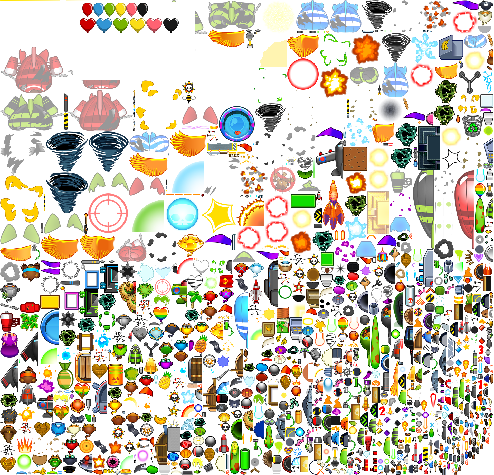

# Bloons Tower Defense 5 Remake 

This is a remake of Bloons Tower Defense 5 I made in processing back in 2021.

My goal was simple: remaking the game all by myself coding wise (*Game concept, title and assets owned by Ninja Kiwi*)

The [wiki](https://bloons.fandom.com/wiki/Bloons_Wiki) was very useful to get the values right.

## Installation
Simply clone the repo and open any script with Processing. That's it! You can then run it and it should work just fine.

## In game shortcuts
- **Start a new round**: `Enter`
- **Change game's speed**: `*`
- **Toggle the pause between rounds**: `ù`
- **Activate the God Mode**: `$`
- **Use once all available abilities**: `²`
- **Cancel out a tower placement**: `Space bar`
- **Change tower's targeting priority**: `1`, `2`, `3` or `4`
- **Sell selected tower**: `S`
- **Augment selected tower left path**: `:`
- **Augment selected tower right path**: `!`


To place towers: 
- **Monkey**: `Q`
- **Tack shooter**: `R`
- **Sniper monkey**: `Z`
- **Boomerang thrower**: `W`
- **Ninja monkey**: `D`
- **Wizard monkey**: `A`
- **Dartling gun**: `M`
- **Spike Factory**: `J`

## About the sprites
All the sprites comes from a single sprite atlas image (shown below) that I had to manually reverse engineer. As you can guess, this was VERY time consuming.

Besides locating each sprite part, it was also needed to carefully find how to correctly assemble them for each sprite. For animated sprites, it was also necessary to align each sprite with the animation.

I constructed a 450 lines text file that hold all the data of the sprites that were interesting to me. Here is a snippet to fully comprehend how much time I put into this.
```
phoenix body : 33*138 a 1518, 1406 half
phoenix wing : 150*93 a 504, 594 offset -6; 0 horizontal mirror
phoenix wing_2 : 147*70 a 810, 114 offset -6; 6 horizontal mirror
phoenix wing_3 : 123*66 a 0, 951 offset -10; 6 horizontal mirror
phoenix wing_4 : 89*64 a 1694, 245 offset -8; 4 horizontal mirror
phoenix wing_5 : 87*77 a 1450, 478 offset -6; 8 horizontal mirror
phoenix wing_6 : 124*92 a 1119, 134 offset -4; 12 horizontal mirror
phoenix wing_7 : 137*101 a 310, 911 offset -4; 10 horizontal mirror
phoenix wing_8 : 142*104 a 661, 507 offset -4; 4 horizontal mirror
phoenix wing_9 : 149*101 a 158, 911 half
```




## Quick FAQ

### I'm popping bloons without gaining money. Why?
That's to prevent `regrow farming` abuse.

This abuse consists of using Wizard or Ninja monkeys to pop and send back regrow bloons (heart shaped) infinitely, thus gaining infinite money.

To prevent this, popping a layer of a regrow bloon will only generate money if that's the first time that this layer has been popped.

___

### Some bloons are popping without reason. Why?
To keep a reasonable FPS, only 500 projectiles are showned each frame. Therefore, some non rendered projectiles can be popping bloons.

___

### Why aren't all towers in the original game implemented?
I only selected a few that I found essential as well as some that I found technically challenging.

___

### Why can I place towers on water?
As I never implemented any water tower, I did not implement that restriction.

___

### Was it necessary to include stats for everything?
Yes! I love seing game stats and everybody should.

___


For more information on this project, watch the project description video https://youtu.be/1060Vlwk3ig
Or contact me directly by mail
